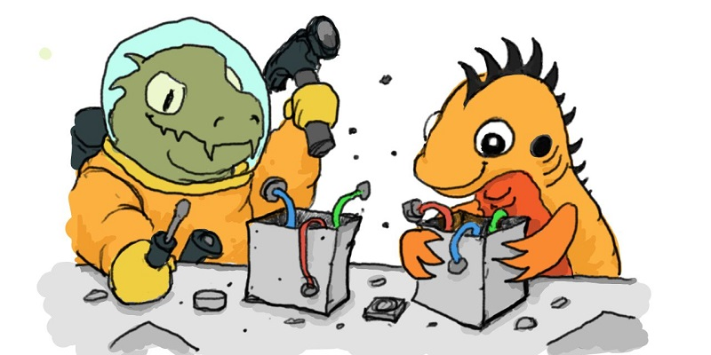

# Ziglings

Welcome to Ziglings! This project contains a series of tiny
broken programs (and one nasty surprise) to learn how to read and write [Zig](https://ziglang.org/) code.

This project was directly inspired by the brilliant and fun
[rustlings](https://github.com/rust-lang/rustlings)
project for the [Rust](https://www.rust-lang.org/) language.
Indirect inspiration comes from [Ruby Koans](http://rubykoans.com/)
and the Little LISPer/Little Schemer series of books.
Ziglings was initiated by [Dave Gauer](https://ratfactor.com/).

Here is the project url: https://codeberg.org/ziglings/exercises

## What's Covered

The primary goal for Ziglings is to cover the core Zig language.

It would be nice to cover the Standard Library as well, but this
is currently challenging because the stdlib is evolving even
faster than the core language (and that's saying something!).
Not only would stdlib coverage change very rapidly, some
exercises might even cease to be relevant entirely.

Having said that, there are some stdlib features that are
probably here to stay or are so important to understand that they
are worth the extra effort to keep current.

Conspicuously absent from Ziglings are a lot of string
manipulation exercises. This is because Zig itself largely avoids
dealing with strings. Hopefully there will be an obvious way to
address this in the future. The Ziglings crew loves strings!

Zig Core Language

* [x] Hello world (main needs to be public)
* [x] Importing standard library
* [x] Assignment
* [x] Arrays
* [x] Strings
* [x] If
* [x] While
* [x] For
* [x] Functions
* [x] Errors (error/try/catch/if-else-err)
* [x] Defer (and errdefer)
* [x] Switch
* [x] Unreachable
* [x] Enums
* [x] Structs
* [x] Pointers
* [x] Optionals
* [x] Struct methods
* [x] Slices
* [x] Many-item pointers
* [x] Unions
* [x] Numeric types (integers, floats)
* [x] Labelled blocks and loops
* [x] Loops as expressions
* [x] Builtins
* [x] Inline loops
* [x] Comptime
* [x] Sentinel termination
* [x] Quoted identifiers @""
* [x] Anonymous structs/tuples/lists
* [ ] Async <--- ironically awaiting upstream Zig updates
* [X] Interfaces
* [X] Bit manipulation
* [X] Working with C
* [X] Threading
* [x] Labeled switch

Zig Standard Library

* [X] String formatting
* [X] Testing
* [X] Tokenization
* [X] File handling

